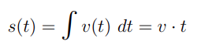

<h1>N-Body Particle Simulation</h1>


This is a simple N-Body Particle Simulation application written in *HTML* and *JavaScript* using the *WebGL-API*.

Online-Version: <https://nowca.github.io/n-body-simulation/nbody-simulation.html>

<br>

<h2>Particle Simulation Application</h2>


<br>

<h3>Multiple N-Body Problem</h3>

The application implements gravitiational physical forces in a small virtual area.

<https://en.wikipedia.org/wiki/N-body_simulation>

<https://en.wikipedia.org/wiki/N-body_problem>

<br>

<h3>HTML5/JS Application Structure</h3>

The application uses native WebGL-Code to display the particle system as OpenGL *POINTS* on a *Model-View-Projection Matrix*.

(It is using the *uniform float value* in the vertex shader: `u_pointSize` Uniform Location, so the point size can be changed on runtime)

<br>

The *HTML/JS* application includes the following source-code-files:

> *src/webgl-wrapper.js* - `WEBGL_W`(-Wrapper)-Object containing *DOM-Nodes*,*Shader-Programs* and *location-reference*s, *Matrix transform functions* and basic functions like *viewport initialization* or *shader loading*.

> *src/nbody-app.js* - `NBODY_APP`-Object containing *application configuration parameters*, *render data* for particle objects, *GUI tool references* and *event handlers* for User Interaction 

with the graphical UI support of external libraries:

> *lib/dat.gui.min.js* - `dat.GUI`-Object for controlling program parameters with the user frontend.
>> Online: *"Lightweight controller library for JavaScript"* <https://github.com/dataarts/dat.gui>

> *lib/stats.min.js* - `Stats`-Object for showing frames per second.
>> Online: *"JavaScript Performance Monitor"* <https://github.com/mrdoob/stats.js/>

<br>

<h2>Using the HTML5 WebGL API</h2>


The Application uses the [WebGL API](https://www.khronos.org/webgl/) to display the algorithm code in the *HTML/JavaScript* application.

The WebGL-Code is implemented in the `WEBGL_W`-Wrapper-Object to call the 3D code functions for WebGL.

<br>

<h3>WEBGL-Object</h3>

This is just a basic explanation of the *WebGL wrapper-object script* (`WEBGL_W`). You can read the official WebGL-API tutorial online: <https://www.khronos.org/webgl/wiki/Tutorial>

The `WEBGL_W`-Object uses 4 main nodes:

```javascript 
012 | var WEBGL_W = {
013 |     context: undefined,
014 |
015 |     HTML: {
...
021 |     APP: {
...
054 |     EVENTS: {
...
062 | };
```
`WEBGL_W.context`: the main context-node for the *WebGL API*.

`WEBGL_W.HTML`: the node for the HTML-canvas-elements

`WEBGL_W.APP`: the application script code for *shader*, *buffer* and *matrix calculations*

`WEBGL_W.EVENTS`: *event functions* for global canvas-events (e. g. window-resizing etc.)

<br>

| `WEBGL_W` - Documentation |
| :------------- |
| You can read a more **[detailed instruction of the WEBGL_W Object ](doc/webgl_wrapper)** in the doc folder. |

<br>

<h2>Implementing the N-Body-Particle-System with the WebGL-Wrapper</h2>

<h3>NBODY_APP-Object</h3>

The main code of the N-Body-Application is in the `NBODY_APP`-Object.

The `NBODY_APP`-Object uses 5 main nodes:

```javascript 
001 | var NBODY_APP = {
002 |     animate: undefined,
003 |     isRunning: true,
004 |    
005 |     CONFIG: {
...
030 |     DATA: {
...
067 |     WEBGL: {
...
076 |     EVENTS: {
...
099 |     GUI: {
...
};
```
`NBODY_APP.CONFIG`: the main configuration-variables of the N-Body Application

`NBODY_APP.DATA`: the node for rendering- and particle-calculation-data

`NBODY_APP.WEBGL`: initialization-, animation-calculation and animation-rendering-functions calling the WebGL-functions in `WEBGL_W`

`NBODY_APP.EVENTS`: events handler-functions and event-configuration

`NBODY_APP.GUI`: node for external GUI-libraries `dat.GUI` and `Stats`

<br>

| `NBODY_APP` - Documentation
| :------------- |
| You can read a more [detailed instruction of the NBODY_APP Object](doc/nbody_app) in the doc folder. |

<br>

<h2>The N-Body Algorithm</h2>

<h3>Implemented Gravitational Algorithm</h3>

The `computeNBody` function in the `NBODY_APP.DATA.ParticleCluster`-sub-object implements the *N-Body-Problem for the calculation of n particles* based on [Newton's law of universal gravitation](https://en.wikipedia.org/wiki/Newton%27s_law_of_universal_gravitation) in the WebGL-Application.


```javascript 
233 | this.computeNBody = function()
234 | {
235 |     // for each particle
236 |     for (var i = 0; i < this.N; i++)
237 |     {
238 |         if (i != j) // ignore accelerating particle
239 |         { 
240 |             this.ax[i] = 0.0;
241 |             this.ay[i] = 0.0;
242 |             this.az[i] = 0.0;
243 |             this.f[i] = 0.0;
244 | 
245 |             // for each other particle
246 |             for (var j = 0; j < this.N; j++)
247 |             {
248 |                 var dx = this.rx[j] - this.rx[i];
249 |                 var dy = this.ry[j] - this.ry[i];
250 |                 var dz = this.rz[j] - this.rz[i];
251 | 
252 |                 var R_ij  = Math.sqrt(dx * dx + dy * dy + dz * dz + eps);
253 |                 var R_ij3 = (R_ij * R_ij * R_ij);
254 | 
255 |                 var f = this.G * this.m[j] / R_ij3;
256 | 
257 |                 this.f[i] += f;
258 | 
259 |                 // set acceleration
260 |                 this.ax[i] += f * dx;
261 |                this.ay[i] += f * dy;
262 |                this.az[i] += f * dz;
263 |            }
264 |
265 |            // set velocity
266 |            this.vx[i] += this.ax[i] * this.dt;
267 |            this.vy[i] += this.ay[i] * this.dt;
268 |            this.vz[i] += this.az[i] * this.dt;
269 |
270 |            // set position
271 |             this.rx[i] += this.vx[i] * this.dt;
272 |             this.ry[i] += this.vy[i] * this.dt;
273 |             this.rz[i] += this.vz[i] * this.dt;
274 |         }
275 |     }
276 | };
```

First we need to calculate the acceleration of n particles with the N-Body Problem, so we can derive the velocity and position from another.


> acceleration (a) of particle (x, y, z) = calculated force (f) * delta of time (dt)
> 
> velocity (v) of particle (x, y, z) = acceleration * delta of time (dt)
> 
> position (s) of particle (x, y, z) = velocity * delta of time (dt)

<br>

by integrating the values for velocity (v += a * t):


and position (s += v * t)



so we get the new position (s) for each particle (i of N).

<br>

<h3>Explanation of the N-Body Algorithm:</h3>


The equation of [Newton's law of universal gravitation](https://en.wikipedia.org/wiki/Newton%27s_law_of_universal_gravitation) explains the calculated **force (F1 and F2)** of to masses **(m1 and m2)** with a **distance (*R*)**.

For that we need to use the **Gravitional Constant (G)**


for calculating the **force vector (x,y,z,) for F1 and F2** of **two masses (m1 and m2)** with the **distance vector (of R1 and R2)**
 


Now we can use this to calculate the N-Body Problem of different particles


The equation calculates the **acceleration of a particle (i)** by integrating the solution of **all other particles (j)** with the following calculations:

- Gravitional Constant (G)
- mass (m )of particle (j)
- distance (R) of of two particles (i and j)
- cubic calculation for the dimensions x, y and z :)
- ...of the absoulte value (always as a positive divisor)

The caluclation of the **distance vector (*R*) of (i) and (j)** is calculated by the use of the [Euclidean Distance](https://en.wikipedia.org/wiki/Euclidean_distance)


It's all a litte bit complicated, but if you try to understand the steps in the code you can understand each calculation step.

<br>

