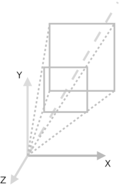
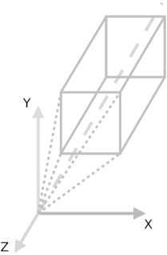
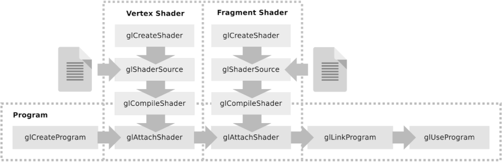

<h2>Using the HTML5 WebGL API</h2>

The Application uses the [WebGL API](https://www.khronos.org/webgl/) to display the algorithm code in the *HTML/JavaScript* application.

It is implemented in the `WEBGL_W`-Wrapper-Object to call the 3D code functions for WebGL.
<br>
<h3>WEBGL-Object</h3>

This is just a basic explanation of the *WebGL wrapper-object script* (`WEBGL_W`).

You can read the official WebGL-API tutorial online: <https://www.khronos.org/webgl/wiki/Tutorial>

<br>

The `WEBGL_W`-Object uses 4 main nodes:

```javascript 
012 | var WEBGL_W = {
013 |     context: undefined,
014 |
015 |     HTML: {
...
021 |     APP: {
...
054 |     EVENTS: {
...
062 | };
```
`WEBGL_W.context`: the main context-node for the *WebGL API*.

`WEBGL_W.HTML`: the node for the HTML-canvas-elements

`WEBGL_W.APP`: the application script code for *shader*, *buffer* and *matrix calculations*

`WEBGL_W.EVENTS`: *event functions* for global canvas-events (e. g. window-resizing etc.)

<br>

<h3>WEBGL_W.context</h3>

The WebGL-Context is often just named `gl` at loading `var gl = canvas.getContext('webgl');`

This is the main *WebGL-API* rendering context node on the HTML-canvas.

For more information look for **WebGLRenderingContext**

<br>

<h3>WEBGL_W.HTML</h3>

The basic HTML-DOM-Nodes for the WebGL Application like the *HTML-Canvas-Node*.

<br>

<h3>WEBGL_W.APP</h3>

The `WEBGL_W.APP` sub-object contains all the basic functions to run the OpenGL-program-application:

<br>

<h4>Matrix-calculation functions</h4>

The `WEBGL_W.APP.Matrix.transform` sub-object contains all the [matrix calculation functions](https://en.wikipedia.org/wiki/Transformation_matrix)


```javascript 
061 | getProjectionMatrix: function(type, fov, aspect, near, far)
```

`WEBGL_W.APP.Matrix.transform.getProjectionMatrix`: returns a perspective-matrix object with the given configuration:

- `type`: the type of projection: perspective or orthographic
> `WEBGL_W.APP.Matrix.projectionType.PERSPECTIVE`
> or
> `WEBGL_W.APP.Matrix.projectionType.ORTHOGRAPHIC`

- `fov`: the FOV (Field Of View) value

- `aspect`: the aspect ratio (normally width/height)

- `near`: the value of the near-plane

- `far`: the value of the far-plane
<br>

| Perspective Projection-Matrix | Orthographic Projection-Matrix |
| ------------- | ------------- |
|  |  |

<br>

The `WEBGL_W.APP.Matrix.transform` sub-object also contains the matrix functions for *3D-Transformation*

- *degree conversion*
- *identity matrix*
- *matrix multiplication*
- *translation*
- *scaling*

<br>

<h4>WebGL-Wrapper functions</h4>

The other functions are the main wrapper functions, where the *WebGL-API* is called and processed:

```javascript 
225 | WEBGL_W.APP.setViewport = function(webglCanvasId)
```
- initializes the *WebGL-Viewport* on a canvas-element by the *canvas-id*

<br>

```javascript 
248 | WEBGL_W.APP.getShader = function(htmlScriptShaderId, SHADER_TYPE)
```
- reads the shader from a DOM-node and compiles it into a shader-program

<br>

```javascript 
273 | WEBGL_W.APP.createShaderProgram = function(vertexShader, fragmentShader)
```
- takes the compiled shader-programs and links and attaches it to the *WebGL-context*

<br>



<br>

<h4>Vertex- and Fragment-Shader-Programs</h4>

You can find the very basic shader programs in the main HTML-File:

```html
016 | <script id="gl-shader-vertex" type="x-shader/x-vertex">
...
033 | <script id="gl-shader-fragment" type="x-shader/x-fragment">
...
```
- which contain just the basic *Model-View-Projection-matrix*, *color*, and *point variables* for the particle-system.

<br>
<h4>More WebGL-Wrapper functions</h4>

```javascript 
303 | WEBGL_W.APP.bindBufferData = function(BUFFER_TYPE, bufferData, DRAW_MODE)
```
- binds and passes data to the buffer and returns the *WebGL-Buffer-object*

<br>

```javascript 
320 | WEBGL_W.APP.getLocationReference = function(BUFFER_TYPE, bufferObject, variableName)
```
- binds a location reference to the shader and copies a *buffer-object* into the variable

<br>